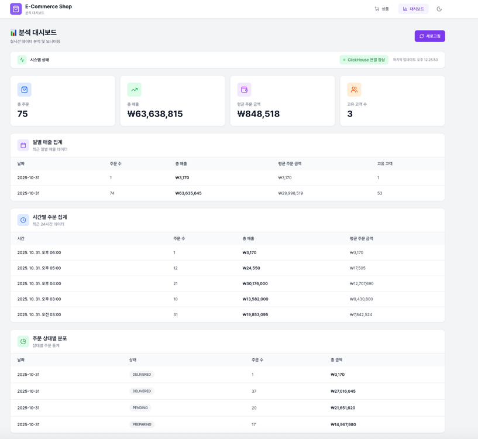
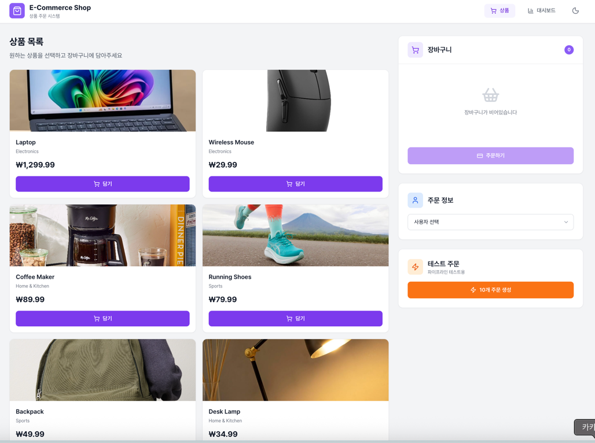

# Kafka-ClickHouse Analytics Backend

**NestJS 기반 이벤트 기반 E-Commerce 분석 파이프라인 백엔드**

이 백엔드는 Outbox Pattern과 Kafka를 활용한 이벤트 기반 아키텍처로 MySQL(OLTP)과 ClickHouse(OLAP) 간의 실시간 데이터 동기화를 담당합니다.

## 📋 목차

- [아키텍처 개요](#아키텍처-개요)
- [구현된 모듈](#구현된-모듈)
- [UI 스크린샷](#ui-스크린샷)
- [API 엔드포인트](#api-엔드포인트)
- [환경 설정](#환경-설정)
- [실행 방법](#실행-방법)
- [데이터 플로우](#데이터-플로우)
- [프로젝트 구조](#프로젝트-구조)
- [알려진 제약사항](#알려진-제약사항)

## 🏗️ 아키텍처 개요

### 기술 스택

- **프레임워크**: NestJS 11.0.1
- **언어**: TypeScript 5.7.3
- **ORM**: TypeORM 0.3.27
- **데이터베이스**: MySQL 8.0 (OLTP), ClickHouse 25.1 (OLAP)
- **메시징**: KafkaJS 2.2.4
- **작업 스케줄링**: @nestjs/schedule 6.0.1
- **검증**: class-validator, class-transformer

### 핵심 패턴

**Outbox Pattern**: 트랜잭션 일관성을 보장하며 이벤트를 안전하게 발행

- Order 생성과 Outbox 이벤트가 동일 MySQL 트랜잭션에서 처리
- Cron 기반 폴링(5초 간격)으로 미처리 이벤트를 Kafka로 전송
- `processed` 플래그로 중복 처리 방지

**이벤트 변환 (Event Transformation)**: Kafka Consumer가 분석용 포맷으로 변환

- `order.events` 토픽에서 원본 이벤트 수신
- 분석용 스키마로 변환 후 `orders_analytics` 토픽 발행
- Kafka Connect Sink가 ClickHouse로 자동 적재

## 🧩 구현된 모듈

### 1. Order Module (`src/order`)

주문 관리 및 생성 기능을 제공합니다.

**엔티티**: `OrderEntity`, `OrderItemEntity`
**기능**:

- 주문 생성 with Outbox Pattern (트랜잭션 보장)
- 주문 조회 (사용자별, 전체)
- 주문 삭제 with Soft Delete + TTL (Admin only)
- OrderStatus 관리 (9가지 상태: PENDING, CONFIRMED, PROCESSING, SHIPPED, DELIVERED, CANCELLED, REFUNDED, FAILED, COMPLETED)

**API**:

```
POST   /api/orders          # 주문 생성
GET    /api/orders/:id      # 주문 조회
GET    /api/orders/user/:userId  # 사용자별 주문 목록

# Admin API
DELETE /admin/orders/:id    # 주문 삭제 (Soft Delete, X-Admin-Id header 필수)
```

### 2. Outbox Module (`src/outbox`)

이벤트 아웃박스 패턴을 구현합니다.

**엔티티**: `OutboxEntity`
**서비스**:

- `OutboxService`: 이벤트 저장 및 조회
- `OutboxRelayService`: Cron 기반 이벤트 릴레이 (5초 간격)

**Cron 설정**:

```typescript
@Cron('*/5 * * * * *')  // 5초마다 실행
async
relayOutboxEvents()
{
  // 미처리 이벤트 100개씩 배치 처리
  // Kafka 발행 성공 시 processed = true로 업데이트
}
```

### 3. Kafka Module (`src/kafka`)

Kafka Producer/Consumer 통합을 제공합니다.

**서비스**:

- `KafkaProducerService`: Kafka 메시지 발행
- `KafkaConsumerService`: 이벤트 변환 및 재발행

**토픽**:

- `order.events`: Outbox 이벤트 원본
- `orders_analytics`: 분석용 변환 데이터

**Consumer Group**: `order-event-transformer`

### 4. ClickHouse Module (`src/clickhouse`)

ClickHouse OLAP 데이터베이스와의 연결을 관리합니다.

**클라이언트**: `@clickhouse/client` v1.12.1
**기능**:

- ClickHouse 쿼리 실행
- Materialized View 조회
- 헬스체크

### 5. Analytics Module (`src/analytics`)

실시간 분석 API를 제공합니다.

**API 엔드포인트**:

```
GET /api/analytics/daily-sales     # 일별 매출 집계
GET /api/analytics/hourly-sales    # 시간별 주문 집계
GET /api/analytics/order-status    # 주문 상태별 분포
GET /api/analytics/stats            # 전체 통계
GET /api/analytics/health           # ClickHouse 연결 상태
```

### 6. User Module (`src/user`)

사용자 관리 기능을 제공합니다.

**엔티티**: `UserEntity`

### 7. Product Module (`src/product`)

상품 관리 기능을 제공합니다.

**엔티티**: `ProductEntity`

### 8. Admin Orders Module (`src/order/admin`)

관리자 전용 주문 관리 기능을 제공합니다.

**컨트롤러**: `AdminOrdersController`
**기능**:

- 주문 Soft Delete (복구 가능)
- OrderDeleted 이벤트 발행 (Outbox Pattern)
- Admin 감사 추적 (X-Admin-Id header)

**API**:

```
DELETE /admin/orders/:id    # 주문 삭제
  Headers: X-Admin-Id (required) - Admin user ID for audit trail
  Response: 204 No Content
```

**삭제 이벤트**: `OrderDeletedEvent`
```typescript
{
  eventType: 'OrderDeleted',
  orderId: string,
  deletedAt: string,        // ISO 8601 timestamp
  deletedBy: string,         // Admin user ID
  version: number            // Unix timestamp in milliseconds
}
```

### 9. Static UI (`public/`)

정적 HTML 대시보드를 제공합니다.

**파일**:

- `index.html`: 메인 대시보드
- `dashboard.html`: 분석 대시보드
- `css/`: 스타일시트

**접근**: `http://localhost:3000/`

## 🎨 UI 스크린샷

### 분석 대시보드 (Dashboard)

실시간 분석 데이터를 시각화하는 메인 대시보드입니다.



**주요 기능**:
- **시스템 상태**: ClickHouse 연결 상태 실시간 모니터링
- **핵심 지표**: 총 주문 수, 총 매출, 고객 수 한눈에 확인
- **일별 매출 집계**: 날짜별 주문 건수 및 매출액 상세 분석
- **시간별 주문 집계**: 시간대별 주문 패턴 분석 (최근 24시간)
- **주문 상태별 분포**: DELIVERED, PENDING, PREPARED 등 상태별 주문 분포 및 금액

**접속**: `http://localhost:3000` 또는 `http://localhost:3000/dashboard.html`

---

### 상품 목록 (E-Commerce Shop)

E-Commerce 상품 카탈로그 및 장바구니 기능을 제공합니다.



**주요 기능**:
- **상품 카탈로그**: Laptop, Wireless Mouse, Coffee Maker 등 다양한 상품 목록
- **장바구니**: 선택한 상품 담기 및 주문 관리
- **주문 정보**: 사용자 선택 및 배송지 정보 입력
- **타임스탬프 추천**: 10개 주문 생성 기능 (데모 및 테스트용)

**접속**: `http://localhost:3000/index.html`

## 🔌 API 엔드포인트

### Order API

| Method | Endpoint                   | Description | Request Body     |
|--------|----------------------------|-------------|------------------|
| POST   | `/api/orders`              | 주문 생성       | `CreateOrderDto` |
| GET    | `/api/orders/:id`          | 주문 조회       | -                |
| GET    | `/api/orders/user/:userId` | 사용자별 주문 목록  | -                |

### Admin Orders API

| Method | Endpoint              | Description | Headers            | Response |
|--------|-----------------------|-------------|--------------------|----------|
| DELETE | `/admin/orders/:id`   | 주문 삭제 (Soft Delete) | `X-Admin-Id` (required) | 204 No Content |

**삭제 요청 예시**:
```bash
curl -X DELETE http://localhost:3000/admin/orders/{orderId} \
  -H "X-Admin-Id: admin-user-123"
```

**CreateOrderDto 예시**:

```json
{
  "userId": 1,
  "status": "PENDING",
  "totalAmount": 50000,
  "items": [
    {
      "productId": 101,
      "quantity": 2,
      "price": 25000
    }
  ]
}
```

### Analytics API

| Method | Endpoint                      | Query Parameters                | Description      |
|--------|-------------------------------|---------------------------------|------------------|
| GET    | `/api/analytics/daily-sales`  | `startDate`, `endDate`          | 일별 매출 집계         |
| GET    | `/api/analytics/hourly-sales` | `startDate`, `endDate`, `limit` | 시간별 주문 집계        |
| GET    | `/api/analytics/order-status` | `startDate`, `endDate`          | 주문 상태별 분포        |
| GET    | `/api/analytics/stats`        | -                               | 전체 통계            |
| GET    | `/api/analytics/health`       | -                               | ClickHouse 연결 상태 |

**응답 예시** (`GET /api/analytics/stats`):

```json
{
  "totalOrders": 1523,
  "totalRevenue": 45678900,
  "averageOrderValue": 29980,
  "totalProducts": 234,
  "totalUsers": 892
}
```

## ⚙️ 환경 설정

### 환경 변수 (.env)

`.env.example` 파일을 `.env`로 복사하여 설정하세요.

```bash
# Application
NODE_ENV=development
PORT=3000

# MySQL (OLTP)
MYSQL_HOST=localhost
MYSQL_PORT=3306
MYSQL_USER=admin
MYSQL_PASSWORD=test123
MYSQL_DATABASE=ecommerce

# Kafka
KAFKA_BROKERS=localhost:19092,localhost:19093,localhost:19094
KAFKA_CLIENT_ID=ecommerce-backend
KAFKA_CONSUMER_GROUP_ID=order-event-transformer

# ClickHouse (OLAP)
CLICKHOUSE_HOST=http://localhost:8123
CLICKHOUSE_USER=admin
CLICKHOUSE_PASSWORD=test123
CLICKHOUSE_DATABASE=analytics

# Outbox Relay
OUTBOX_BATCH_SIZE=100
OUTBOX_POLLING_INTERVAL=*/5 * * * * *
```

### 필수 서비스

백엔드 실행 전에 다음 서비스가 실행 중이어야 합니다:

1. **MySQL** (localhost:3306)
2. **Kafka 3-node Cluster** (localhost:19092, 19093, 19094)
3. **ClickHouse** (localhost:8123)

**인프라 시작** (프로젝트 루트에서):

```bash
cd ..
make setup    # 전체 인프라 시작 + DB 초기화
```

## 🚀 실행 방법

### 1. 의존성 설치

```bash
npm install
```

### 2. 환경 설정

```bash
cp .env.example .env
# .env 파일 수정 (필요시)
```

### 3. 개발 모드 실행

```bash
# Watch 모드 (hot reload)
npm run start:dev

# 일반 개발 모드
npm run start

# 디버그 모드
npm run start:debug
```

**접속 확인**:

- 백엔드 API: http://localhost:3000/api
- HTML 대시보드: http://localhost:3000

### 4. 프로덕션 빌드

```bash
# 빌드
npm run build

# 프로덕션 실행
npm run start:prod
```

### 5. 테스트

```bash
# 단위 테스트
npm run test

# E2E 테스트
npm run test:e2e

# 테스트 커버리지
npm run test:cov

# Order Deletion Flow E2E 테스트
cd ..
./scripts/test-deletion-flow.sh
```

**삭제 플로우 테스트 시나리오**:
1. 테스트 주문 생성 (POST /api/orders)
2. MySQL 주문 확인
3. ClickHouse 전파 확인 (15초 대기)
4. Admin API로 주문 삭제 (DELETE /admin/orders/:id)
5. MySQL soft delete 확인 (deleted_at 설정)
6. ClickHouse 삭제 이벤트 확인 (is_deleted=1, event_type=DELETED)
7. Materialized Views 필터링 확인 (삭제된 주문 제외)

## 🔄 데이터 플로우

### 전체 파이프라인

```
┌─────────────────────────────────────────────────────────────┐
│  1. Order Creation (REST API)                               │
│  POST /api/orders                                            │
└────────────┬────────────────────────────────────────────────┘
             ↓
┌─────────────────────────────────────────────────────────────┐
│  2. MySQL Transaction (OLTP)                                │
│  - orders 테이블 INSERT                                      │
│  - order_items 테이블 INSERT                                 │
│  - outbox 테이블 INSERT (동일 트랜잭션)                      │
└────────────┬────────────────────────────────────────────────┘
             ↓
┌─────────────────────────────────────────────────────────────┐
│  3. Outbox Relay (Cron 5초 폴링)                            │
│  OutboxRelayService                                          │
│  - processed = false인 이벤트 100개 조회                     │
│  - Kafka order.events 토픽으로 발행                          │
│  - processed = true로 업데이트                               │
└────────────┬────────────────────────────────────────────────┘
             ↓
┌─────────────────────────────────────────────────────────────┐
│  4. Kafka order.events Topic                                │
│  - Replication Factor: 3                                     │
│  - Partitions: 3                                             │
└────────────┬────────────────────────────────────────────────┘
             ↓
┌─────────────────────────────────────────────────────────────┐
│  5. Kafka Consumer (Event Transformer)                      │
│  KafkaConsumerService                                        │
│  - order.events 구독                                         │
│  - OrderCreated/OrderDeleted 이벤트 변환                    │
│  - 분석용 스키마로 매핑                                      │
│  - orders_analytics 토픽으로 재발행                          │
└────────────┬────────────────────────────────────────────────┘
             ↓
┌─────────────────────────────────────────────────────────────┐
│  6. Kafka orders_analytics Topic                            │
└────────────┬────────────────────────────────────────────────┘
             ↓
┌─────────────────────────────────────────────────────────────┐
│  7. Kafka Connect ClickHouse Sink                           │
│  - orders_analytics 토픽 구독                                │
│  - ClickHouse orders_analytics 테이블로 자동 적재            │
└────────────┬────────────────────────────────────────────────┘
             ↓
┌─────────────────────────────────────────────────────────────┐
│  8. ClickHouse (OLAP)                                       │
│  - orders_analytics 테이블 (ReplacingMergeTree)             │
│  - Materialized Views:                                       │
│    • daily_sales_mv: 일별 매출 집계                         │
│    • hourly_sales_mv: 시간별 주문 집계                      │
│    • order_status_mv: 주문 상태별 분포                      │
│    • user_analytics_mv: 사용자별 주문 통계                  │
└────────────┬────────────────────────────────────────────────┘
             ↓
┌─────────────────────────────────────────────────────────────┐
│  9. Analytics API                                           │
│  GET /api/analytics/*                                        │
│  - ClickHouseService로 Materialized View 쿼리               │
│  - 실시간 집계 데이터 제공                                   │
└─────────────────────────────────────────────────────────────┘
```

### Order Deletion Flow (Soft Delete + TTL)

```
┌─────────────────────────────────────────────────────────────┐
│  1. Admin API Call                                          │
│  DELETE /admin/orders/:id                                    │
│  Header: X-Admin-Id (required for audit trail)              │
└────────────┬────────────────────────────────────────────────┘
             ↓
┌─────────────────────────────────────────────────────────────┐
│  2. MySQL Transaction                                        │
│  - orders.deleted_at = NOW() (Soft Delete)                  │
│  - outbox INSERT OrderDeleted event (동일 트랜잭션)          │
│    payload: { orderId, deletedAt, deletedBy, version }      │
└────────────┬────────────────────────────────────────────────┘
             ↓
┌─────────────────────────────────────────────────────────────┐
│  3. Outbox Relay (Cron 5초 폴링)                            │
│  - OrderDeleted 이벤트를 Kafka order.events 토픽으로 발행   │
└────────────┬────────────────────────────────────────────────┘
             ↓
┌─────────────────────────────────────────────────────────────┐
│  4. Kafka Consumer (Event Transformer)                      │
│  - OrderDeleted 이벤트 수신                                  │
│  - MySQL에서 Order + User + OrderItem 데이터 조회 (Hybrid)  │
│  - 삭제 포맷으로 변환:                                       │
│    • event_type: 'DELETED'                                   │
│    • is_deleted: 1                                           │
│    • deleted_at: timestamp                                   │
│    • version: Unix timestamp (ms)                            │
│  - orders_analytics 토픽으로 재발행                          │
└────────────┬────────────────────────────────────────────────┘
             ↓
┌─────────────────────────────────────────────────────────────┐
│  5. ClickHouse ReplacingMergeTree                           │
│  - 동일 order_id에 대해 새 버전 INSERT                       │
│  - FINAL 쿼리 시 version 높은 row가 선택됨                  │
│  - 결과: is_deleted=1, deleted_at 설정된 최신 버전          │
└────────────┬────────────────────────────────────────────────┘
             ↓
┌─────────────────────────────────────────────────────────────┐
│  6. Materialized Views Filtering                            │
│  - 모든 MV는 WHERE is_deleted=0 필터 적용                   │
│  - 삭제된 주문은 자동으로 집계에서 제외                      │
│  - daily_sales_mv, hourly_sales_mv 등 모두 정확한 통계 유지 │
└────────────┬────────────────────────────────────────────────┘
             ↓
┌─────────────────────────────────────────────────────────────┐
│  7. TTL Physical Deletion (7 days later)                    │
│  - TTL: deleted_at + INTERVAL 7 DAY DELETE                  │
│  - is_deleted=1인 row는 7일 후 자동 물리 삭제               │
│  - 복구 가능 기간: 7일 (Soft Delete 기간)                   │
└─────────────────────────────────────────────────────────────┘
```

### 레이턴시 목표 (MVP)

| 구간                 | 목표        | 측정 방법                    |
|--------------------|-----------|--------------------------|
| API → MySQL        | <50ms     | REST API 응답 시간           |
| Outbox → Kafka     | 5-10초     | Polling interval (5초)    |
| Kafka → ClickHouse | 실시간       | Kafka Connect 자동 처리      |
| Analytics Query    | <100ms    | Materialized View 쿼리     |
| **전체 E2E**         | **5-10초** | Order 생성 → ClickHouse 반영 |

## 📁 프로젝트 구조

```
backend/
├── src/
│   ├── analytics/              # Analytics API 모듈
│   │   ├── analytics.controller.ts
│   │   ├── analytics.service.ts
│   │   └── analytics.module.ts
│   │
│   ├── clickhouse/             # ClickHouse 통합 모듈
│   │   ├── clickhouse.service.ts
│   │   ├── clickhouse.module.ts
│   │   └── dto/
│   │       ├── daily-sales.dto.ts
│   │       ├── hourly-sales.dto.ts
│   │       ├── order-status.dto.ts
│   │       └── overall-stats.dto.ts
│   │
│   ├── kafka/                  # Kafka Producer/Consumer 모듈
│   │   ├── kafka-producer.service.ts
│   │   ├── kafka-consumer.service.ts
│   │   └── kafka.module.ts
│   │
│   ├── order/                  # 주문 관리 모듈
│   │   ├── order.controller.ts
│   │   ├── order.service.ts
│   │   ├── order.module.ts
│   │   ├── entities/
│   │   │   ├── order.entity.ts
│   │   │   └── order-item.entity.ts
│   │   └── dto/
│   │       ├── create-order.dto.ts
│   │       └── order-response.dto.ts
│   │
│   ├── outbox/                 # Outbox Pattern 모듈
│   │   ├── outbox.service.ts
│   │   ├── outbox-relay.service.ts  # Cron 폴링
│   │   ├── outbox.module.ts
│   │   └── entities/
│   │       └── outbox.entity.ts
│   │
│   ├── user/                   # 사용자 관리 모듈
│   │   ├── user.controller.ts
│   │   ├── user.service.ts
│   │   ├── user.module.ts
│   │   └── entities/
│   │       └── user.entity.ts
│   │
│   ├── product/                # 상품 관리 모듈
│   │   ├── product.controller.ts
│   │   ├── product.service.ts
│   │   ├── product.module.ts
│   │   └── entities/
│   │       └── product.entity.ts
│   │
│   ├── app.module.ts           # 루트 모듈
│   ├── app.controller.ts
│   ├── app.service.ts
│   └── main.ts                 # 애플리케이션 엔트리포인트
│
├── public/                     # 정적 파일 (HTML UI)
│   ├── index.html
│   ├── dashboard.html
│   └── css/
│
├── dist/                       # 컴파일된 파일 (자동 생성)
├── test/                       # E2E 테스트
├── .env.example                # 환경 변수 템플릿
├── nest-cli.json               # NestJS CLI 설정
├── tsconfig.json               # TypeScript 설정
└── package.json                # 의존성 및 스크립트
```

## ⚠️ 알려진 제약사항

### 1. Payment 관리 관련

주문 MVP 서비스이므로 그 이후 프로세스인 계산과 payment 상태 관리 등은 처리하지 않음.

**영향**: ClickHouse `orders_analytics` 테이블의 해당 컬럼이 불완전한 데이터로 채워집니다.

## 📚 참고 문서

프로젝트 루트 디렉토리의 문서를 참조하세요:

- **전체 아키텍처**: `../docs/architecture/system-architecture-diagram.md`
- **구현 가이드**: `../docs/architecture/IMPLEMENTATION_GUIDE.md`
- **ADR**: `../docs/architecture/ADR-001-event-driven-architecture.md`
- **데이터베이스 스키마**: `../docs/architecture/database-schema-design.md`
- **프로젝트 개요**: `../CLAUDE.md`
- **Make 명령어**: `../MAKEFILE_GUIDE.md`

## 🔧 트러블슈팅

### Kafka 연결 실패

```bash
# Kafka 클러스터 상태 확인
cd ..
make kafka-cluster-info

# 토픽 존재 확인
make kafka-topics
```

### ClickHouse 연결 실패

```bash
# ClickHouse 헬스체크
curl http://localhost:8123/ping

# 백엔드 헬스체크 API
curl http://localhost:3000/api/analytics/health
```

### Outbox Relay 동작 확인

```bash
# MySQL outbox 테이블 확인
make mysql-shell
> SELECT COUNT(*), processed FROM outbox GROUP BY processed;

# 백엔드 로그 확인
npm run start:dev
# "Relayed X events to Kafka" 로그 확인
```

### 전체 파이프라인 테스트

```bash
# 프로젝트 루트에서
cd ..
make test-pipeline
```

## 🤝 기여

이 프로젝트는 MVP 학습 목적으로 개발되었습니다.

## 📄 라이선스

MIT License
