# ADR-001: MVP Event-Driven Data Pipeline with Outbox Pattern

## Status
Accepted

## Context

### MVP 목표
간단한 쇼핑몰을 예시로 **이벤트 기반 데이터 파이프라인**을 로컬 환경에서 구축합니다.

**핵심 목표 (우선순위 순)**:
1. **Outbox Pattern 구현**: 트랜잭션 일관성 보장
2. **Kafka Event Streaming**: 이벤트 기반 아키텍처
3. **ClickHouse 실시간 집계**: OLAP 분석 데이터베이스
4. **Grafana 모니터링**: 실시간 대시보드

**비목표 (MVP 범위 외)**:
- ❌ 복잡한 MSA 구조 (Monolith 단일 서비스)
- ❌ CQRS 패턴 (읽기/쓰기 분리 없음)
- ❌ Kubernetes 배포 (로컬 Docker Compose만)
- ❌ 완성된 프론트엔드 (최소 기능만)

### 기술 스택
- **Backend**: NestJS Monolith (TypeScript)
- **Frontend**: React (간단한 주문 폼)
- **OLTP Database**: MySQL 8.0
- **OLAP Database**: ClickHouse
- **Message Broker**: Apache Kafka
- **Event Relay**: NestJS Cron Job (Polling)
- **Orchestration**: Docker Compose
- **Monitoring**: Grafana + Prometheus

### 문제 정의
전통적인 Monolith 아키텍처에서 분석 데이터를 실시간으로 처리하기 어렵습니다:

1. **OLTP vs OLAP 워크로드 충돌**: MySQL에서 트랜잭션과 분석 쿼리를 동시에 실행하면 성능 저하
2. **데이터 일관성 문제**: 비즈니스 로직과 이벤트 발행을 별도로 처리하면 불일치 발생 가능
3. **확장성 제약**: 단일 데이터베이스로 인한 병목 현상

## Decision

MVP는 다음과 같은 **단순화된 이벤트 기반 아키텍처**를 채택합니다:

### 1. Outbox Pattern with Cron Polling

**결정**: MySQL 트랜잭션과 이벤트 발행을 원자적으로 처리

**구현 방식**:
```typescript
// src/modules/order/order.service.ts
@Injectable()
export class OrderService {
  constructor(
    @InjectRepository(Order) private orderRepo: Repository<Order>,
    @InjectRepository(Outbox) private outboxRepo: Repository<Outbox>,
  ) {}

  @Transactional()
  async createOrder(dto: CreateOrderDto): Promise<Order> {
    // 1. 비즈니스 엔티티 저장
    const order = await this.orderRepo.save({
      userId: dto.userId,
      items: dto.items,
      totalAmount: dto.totalAmount,
      status: 'PENDING',
    });

    // 2. Outbox 이벤트 저장 (같은 트랜잭션 내)
    await this.outboxRepo.save({
      aggregateId: order.id,
      aggregateType: 'Order',
      eventType: 'OrderCreated',
      payload: JSON.stringify({
        orderId: order.id,
        userId: order.userId,
        totalAmount: order.totalAmount,
        items: order.items,
      }),
      processed: false,
    });

    return order;
  }
}
```

**Outbox Relay (Cron Polling)**:
```typescript
// src/outbox/outbox-relay.service.ts
@Injectable()
export class OutboxRelayService {
  constructor(
    @InjectRepository(Outbox) private outboxRepo: Repository<Outbox>,
    private kafkaProducer: KafkaProducerService,
  ) {}

  @Cron('*/5 * * * * *') // 5초마다 실행
  async relayEvents() {
    // 1. 미처리 이벤트 조회 (LIMIT 100)
    const events = await this.outboxRepo.find({
      where: { processed: false },
      order: { createdAt: 'ASC' },
      take: 100,
    });

    if (events.length === 0) return;

    // 2. Kafka로 발행
    for (const event of events) {
      try {
        await this.kafkaProducer.send({
          topic: `${event.aggregateType.toLowerCase()}.events`,
          messages: [{
            key: event.aggregateId,
            value: event.payload,
            headers: {
              eventType: event.eventType,
              aggregateType: event.aggregateType,
            },
          }],
        });

        // 3. 처리 완료 마킹
        event.processed = true;
        event.processedAt = new Date();
        await this.outboxRepo.save(event);

      } catch (error) {
        // 4. 재시도 카운트 증가
        event.retryCount = (event.retryCount || 0) + 1;
        await this.outboxRepo.save(event);

        this.logger.error(`Failed to relay event ${event.id}`, error);
      }
    }

    this.logger.log(`Relayed ${events.length} events to Kafka`);
  }
}
```

**트레이드오프**:
- ✅ 장점: 구현 단순함, Debezium 복잡도 제거, 재시도 로직 명확한 제어
- ⚠️ 단점: 폴링 간격에 따른 지연 (5-10초), DB 부하 (인덱스로 완화)

### 2. Apache Kafka for Event Streaming

**결정**: 간단한 Kafka 토픽 구조로 이벤트 스트리밍

**토픽 구조**:
```
order.events          # 주문 이벤트 (OrderCreated, OrderCancelled)
payment.events        # 결제 이벤트 (PaymentCompleted, PaymentFailed)
inventory.events      # 재고 이벤트 (StockReserved, StockReleased)
orders_analytics      # ClickHouse 적재용 (변환된 데이터)
```

**Producer**:
```typescript
// src/kafka/kafka-producer.service.ts
@Injectable()
export class KafkaProducerService {
  private producer: Producer;

  async onModuleInit() {
    const kafka = new Kafka({
      clientId: 'ecommerce-app',
      brokers: ['localhost:9092'],
    });
    this.producer = kafka.producer();
    await this.producer.connect();
  }

  async send(record: ProducerRecord) {
    return this.producer.send(record);
  }
}
```

**Consumer (이벤트를 분석 토픽으로 변환)**:
```typescript
// src/kafka/kafka-consumer.service.ts
@Injectable()
export class KafkaConsumerService {
  async consumeOrderEvents() {
    const consumer = kafka.consumer({ groupId: 'analytics-transformer' });
    await consumer.subscribe({ topic: 'order.events' });

    await consumer.run({
      eachMessage: async ({ topic, partition, message }) => {
        const event = JSON.parse(message.value.toString());

        // 분석용 포맷으로 변환
        const analyticsEvent = {
          order_id: event.orderId,
          user_id: event.userId,
          order_date: new Date(),
          total_amount: event.totalAmount,
          items_count: event.items.length,
          status: 'PENDING',
        };

        // orders_analytics 토픽으로 발행 (ClickHouse Sink가 소비)
        await this.producer.send({
          topic: 'orders_analytics',
          messages: [{ value: JSON.stringify(analyticsEvent) }],
        });
      },
    });
  }
}
```

### 3. ClickHouse Kafka Connect Sink

**결정**: Kafka Connect Sink Connector로 ClickHouse에 자동 적재

**Connector 구성** (`kafka-connect/clickhouse-sink.json`):
```json
{
  "name": "clickhouse-sink-orders",
  "config": {
    "connector.class": "com.clickhouse.kafka.connect.ClickHouseSinkConnector",
    "tasks.max": "1",
    "topics": "orders_analytics",
    "clickhouse.server.url": "clickhouse",
    "clickhouse.server.port": "8123",
    "clickhouse.server.database": "analytics",
    "clickhouse.table.name": "orders_analytics",
    "key.converter": "org.apache.kafka.connect.storage.StringConverter",
    "value.converter": "org.apache.kafka.connect.json.JsonConverter",
    "value.converter.schemas.enable": "false",
    "insert.mode": "INSERT",
    "batch.size": "1000",
    "buffer.count.records": "1000"
  }
}
```

**설정 방법**:
```bash
# Kafka Connect 실행 후 Connector 등록
curl -X POST http://localhost:8083/connectors \
  -H "Content-Type: application/json" \
  -d @kafka-connect/clickhouse-sink.json
```

### 4. ClickHouse Analytics Database

**결정**: 실시간 집계를 위한 Materialized Views 활용

**스키마**:
```sql
-- 분석 데이터베이스
CREATE DATABASE IF NOT EXISTS analytics;

-- 주문 분석 테이블
CREATE TABLE analytics.orders_analytics (
    order_id String,
    user_id String,
    order_date DateTime,
    total_amount Decimal(10, 2),
    items_count UInt32,
    status String,
    created_at DateTime DEFAULT now()
)
ENGINE = ReplacingMergeTree(created_at)
PARTITION BY toYYYYMM(order_date)
ORDER BY (order_date, user_id, order_id);

-- 일별 매출 집계 (Materialized View)
CREATE MATERIALIZED VIEW analytics.daily_sales_mv
ENGINE = SummingMergeTree()
PARTITION BY toYYYYMM(order_date)
ORDER BY order_date
POPULATE
AS SELECT
    toDate(order_date) as order_date,
    count() as order_count,
    sum(total_amount) as total_revenue,
    avg(total_amount) as avg_order_value
FROM analytics.orders_analytics
GROUP BY order_date;

-- 시간별 매출 집계
CREATE MATERIALIZED VIEW analytics.hourly_sales_mv
ENGINE = SummingMergeTree()
PARTITION BY toYYYYMM(order_hour)
ORDER BY order_hour
AS SELECT
    toStartOfHour(order_date) as order_hour,
    count() as order_count,
    sum(total_amount) as total_revenue
FROM analytics.orders_analytics
GROUP BY order_hour;
```

**분석 쿼리 예시**:
```sql
-- 오늘 매출 현황
SELECT
    order_count,
    total_revenue,
    avg_order_value
FROM analytics.daily_sales_mv
WHERE order_date = today();

-- 최근 24시간 시간별 트렌드
SELECT
    toHour(order_hour) as hour,
    sum(order_count) as orders,
    sum(total_revenue) as revenue
FROM analytics.hourly_sales_mv
WHERE order_hour >= now() - INTERVAL 24 HOUR
GROUP BY hour
ORDER BY hour;
```

### 5. MySQL OLTP Database

**결정**: 트랜잭션 데이터는 MySQL에 저장

**주요 테이블**:
```sql
-- 주문 테이블
CREATE TABLE orders (
    id VARCHAR(36) PRIMARY KEY,
    user_id VARCHAR(36) NOT NULL,
    total_amount DECIMAL(10, 2) NOT NULL,
    status ENUM('PENDING', 'COMPLETED', 'CANCELLED') DEFAULT 'PENDING',
    created_at TIMESTAMP DEFAULT CURRENT_TIMESTAMP,
    updated_at TIMESTAMP DEFAULT CURRENT_TIMESTAMP ON UPDATE CURRENT_TIMESTAMP,
    INDEX idx_user_created (user_id, created_at),
    INDEX idx_status (status)
) ENGINE=InnoDB;

-- Outbox 테이블 (이벤트 저장)
CREATE TABLE outbox (
    id BIGINT AUTO_INCREMENT PRIMARY KEY,
    aggregate_id VARCHAR(36) NOT NULL,
    aggregate_type VARCHAR(50) NOT NULL,
    event_type VARCHAR(100) NOT NULL,
    payload JSON NOT NULL,
    processed BOOLEAN DEFAULT FALSE,
    processed_at TIMESTAMP NULL,
    retry_count INT DEFAULT 0,
    created_at TIMESTAMP DEFAULT CURRENT_TIMESTAMP,
    INDEX idx_processed_created (processed, created_at),
    INDEX idx_aggregate (aggregate_id, aggregate_type)
) ENGINE=InnoDB;
```

**인덱스 최적화**:
- `idx_processed_created`: Cron 폴링 성능 최적화 (WHERE processed=false ORDER BY created_at)
- `idx_aggregate`: 특정 엔티티의 이벤트 조회 최적화

### 6. Grafana Monitoring Dashboard

**결정**: Grafana로 실시간 비즈니스 메트릭 시각화

**ClickHouse 데이터 소스 설정**:
```yaml
# grafana/provisioning/datasources/clickhouse.yml
apiVersion: 1
datasources:
  - name: ClickHouse
    type: vertamedia-clickhouse-datasource
    url: http://clickhouse:8123
    access: proxy
    database: analytics
    isDefault: true
```

**대시보드 패널 예시**:
1. **실시간 매출**: 시간별 매출 그래프
2. **주문 현황**: 오늘 주문 수, 총 매출
3. **평균 주문 금액**: AOV 트렌드
4. **주문 상태 분포**: 상태별 파이 차트

## Architecture Diagram

```mermaid
graph TB
    subgraph "Frontend"
        React[React App<br/>간단한 주문 폼]
    end

    subgraph "Backend - NestJS Monolith"
        API[REST API]
        OrderModule[Order Module]
        PaymentModule[Payment Module]
        InventoryModule[Inventory Module]
        OutboxRelay[Outbox Relay<br/>Cron Job]
        KafkaConsumer[Kafka Consumer<br/>Event Transformer]
    end

    subgraph "Data Layer"
        MySQL[(MySQL 8.0<br/>OLTP)]
        OutboxTable[Outbox Table]
    end

    subgraph "Event Streaming"
        Kafka[Apache Kafka]
        Topics["Topics:<br/>order.events<br/>orders_analytics"]
        KafkaConnect[Kafka Connect<br/>ClickHouse Sink]
    end

    subgraph "Analytics"
        ClickHouse[(ClickHouse)]
        MaterializedViews[Materialized Views<br/>실시간 집계]
        Grafana[Grafana<br/>대시보드]
    end

    React -->|HTTP POST /orders| API
    API --> OrderModule
    API --> PaymentModule
    API --> InventoryModule

    OrderModule -->|Write + Outbox| MySQL
    MySQL --> OutboxTable

    OutboxRelay -->|Poll every 5s| OutboxTable
    OutboxRelay -->|Produce| Kafka

    Kafka --> Topics
    Topics -->|Consume| KafkaConsumer
    KafkaConsumer -->|Produce analytics| Kafka

    Topics -->|Sink Connector| KafkaConnect
    KafkaConnect -->|Batch Insert| ClickHouse

    ClickHouse --> MaterializedViews
    Grafana -->|Query| MaterializedViews

    style React fill:#61dafb
    style API fill:#e0234e
    style OutboxRelay fill:#ff6b6b
    style Kafka fill:#231f20
    style ClickHouse fill:#ffcc00
    style Grafana fill:#f46800
```



## Consequences

### 긍정적 영향 (Pros)

#### 1. 구현 단순성
- Debezium 제거로 인프라 복잡도 감소
- Monolith 구조로 서비스 간 통신 제거
- Docker Compose로 로컬 실행 가능

#### 2. 학습 효과
- Outbox Pattern 핵심 개념 이해
- Kafka Event Streaming 경험
- ClickHouse OLAP 성능 체험
- 이벤트 기반 아키텍처 원리 학습

#### 3. 데이터 일관성
- MySQL 트랜잭션으로 비즈니스 로직과 이벤트 원자적 저장
- 이벤트 누락 방지

#### 4. 분석 성능
- ClickHouse Materialized Views로 실시간 집계
- 복잡한 분석 쿼리도 밀리초 응답 (100x ~ 1000x 빠름)

#### 5. 확장 가능성
- 향후 MSA로 전환 가능한 구조
- Kafka 파티션으로 수평 확장 준비
- ClickHouse 클러스터로 확장 가능

### 부정적 영향 (Cons)

#### 1. Polling 지연
- Cron 간격(5초)만큼 이벤트 전달 지연
- Debezium CDC 대비 느림 (수 밀리초 vs 수 초)

**완화 방안**:
- MVP는 5초 지연 허용 (실시간성 중요하지 않음)
- 향후 Debezium으로 전환 가능

#### 2. DB 부하
- 5초마다 Outbox 테이블 폴링으로 부하 발생

**완화 방안**:
- 인덱스 최적화 (`idx_processed_created`)
- LIMIT 100으로 배치 크기 제한
- 프로덕션에서는 Debezium 고려

#### 3. 단일 장애점
- Monolith 서비스 다운 시 전체 시스템 중단

**완화 방안**:
- MVP는 단일 인스턴스로 충분
- 프로덕션에서는 MSA + Load Balancer

#### 4. 최종 일관성
- ClickHouse 데이터 동기화에 5-10초 지연

**완화 방안**:
- 대시보드는 실시간성 요구 낮음
- 중요한 조회는 MySQL에서 직접

### 기술 부채 및 향후 고려사항

#### 1. Debezium 전환
- 프로덕션에서는 Cron → Debezium CDC 고려
- 낮은 지연시간 필요 시 전환

#### 2. MSA 분리
- 서비스 경계 명확해지면 모듈 → 별도 서비스 분리
- 이미 이벤트 기반으로 설계되어 전환 용이

#### 3. 멱등성 처리
- Kafka Consumer에 멱등성 키 구현 (중복 이벤트 방지)
- ClickHouse ReplacingMergeTree로 중복 제거

#### 4. 장애 처리
- Dead Letter Queue 구현 (처리 실패 이벤트)
- 재시도 로직 강화 (Exponential Backoff)

## Implementation Roadmap

### Phase 1: 로컬 인프라 구축 (Week 1)
- [ ] Docker Compose 작성 (MySQL, Kafka, ClickHouse, Grafana)
- [ ] MySQL 스키마 생성 (orders, outbox)
- [ ] ClickHouse 스키마 생성 (orders_analytics, materialized views)
- [ ] Kafka 토픽 생성

### Phase 2: Outbox Pattern 구현 (Week 2)
- [ ] NestJS Monolith 프로젝트 생성
- [ ] Order Module 구현 (주문 생성 + Outbox 저장)
- [ ] Outbox Relay Service (Cron Polling → Kafka)
- [ ] 데이터 일관성 테스트

### Phase 3: Kafka Pipeline 구축 (Week 3)
- [ ] Kafka Consumer (Event Transformer)
- [ ] Kafka Connect ClickHouse Sink 설정
- [ ] ClickHouse 데이터 적재 검증

### Phase 4: Grafana 대시보드 (Week 4)
- [ ] Grafana 데이터 소스 설정 (ClickHouse)
- [ ] 실시간 매출 대시보드 생성
- [ ] 주문 현황 패널 추가

### Phase 5: 간단한 FE (Optional)
- [ ] React 주문 생성 폼
- [ ] API 연동
- [ ] 주문 내역 조회

## Docker Compose 구성

```yaml
version: '3.8'
services:
  mysql:
    image: mysql:8.0
    environment:
      MYSQL_ROOT_PASSWORD: test123
      MYSQL_DATABASE: ecommerce
    ports:
      - "3306:3306"
    volumes:
      - mysql-data:/var/lib/mysql

  zookeeper:
    image: confluentinc/cp-zookeeper:7.5.0
    environment:
      ZOOKEEPER_CLIENT_PORT: 2181

  kafka:
    image: confluentinc/cp-kafka:7.5.0
    depends_on:
      - zookeeper
    ports:
      - "9092:9092"
    environment:
      KAFKA_BROKER_ID: 1
      KAFKA_ZOOKEEPER_CONNECT: zookeeper:2181
      KAFKA_ADVERTISED_LISTENERS: PLAINTEXT://localhost:9092
      KAFKA_OFFSETS_TOPIC_REPLICATION_FACTOR: 1

  kafka-connect:
    image: confluentinc/cp-kafka-connect:7.5.0
    depends_on:
      - kafka
      - clickhouse
    ports:
      - "8083:8083"
    environment:
      CONNECT_BOOTSTRAP_SERVERS: kafka:9092
      CONNECT_REST_PORT: 8083
      CONNECT_GROUP_ID: "clickhouse-sink"
      CONNECT_CONFIG_STORAGE_TOPIC: "connect-configs"
      CONNECT_OFFSET_STORAGE_TOPIC: "connect-offsets"
      CONNECT_STATUS_STORAGE_TOPIC: "connect-status"
      CONNECT_KEY_CONVERTER: "org.apache.kafka.connect.storage.StringConverter"
      CONNECT_VALUE_CONVERTER: "org.apache.kafka.connect.json.JsonConverter"
      CONNECT_VALUE_CONVERTER_SCHEMAS_ENABLE: "false"
      CONNECT_PLUGIN_PATH: "/usr/share/java,/usr/share/confluent-hub-components"

  clickhouse:
    image: clickhouse/clickhouse-server:latest
    ports:
      - "8123:8123"
      - "9000:9000"
    volumes:
      - clickhouse-data:/var/lib/clickhouse

  grafana:
    image: grafana/grafana:latest
    depends_on:
      - clickhouse
    ports:
      - "3001:3000"
    environment:
      GF_SECURITY_ADMIN_PASSWORD: test123
    volumes:
      - grafana-data:/var/lib/grafana

volumes:
  mysql-data:
  clickhouse-data:
  grafana-data:
```

## References

### 패턴 및 아키텍처
- [Outbox Pattern](https://microservices.io/patterns/data/transactional-outbox.html)
- [Event-Driven Architecture](https://martinfowler.com/articles/201701-event-driven.html)

### 기술 문서
- [Apache Kafka Documentation](https://kafka.apache.org/documentation/)
- [ClickHouse Kafka Integration](https://clickhouse.com/docs/en/engines/table-engines/integrations/kafka)
- [Kafka Connect](https://docs.confluent.io/platform/current/connect/index.html)
- [NestJS Task Scheduling](https://docs.nestjs.com/techniques/task-scheduling)

### ClickHouse
- [ClickHouse Materialized Views](https://clickhouse.com/docs/en/guides/developer/cascading-materialized-views)
- [ReplacingMergeTree](https://clickhouse.com/docs/en/engines/table-engines/mergetree-family/replacingmergetree)

## Decision Makers
- 작성자: Architecture Team
- 검토자: Backend Lead
- 승인자: Tech Lead

## Revision History
- 2025-10-12: MVP 아키텍처로 재작성 (MySQL, Cron Polling, 로컬 Docker Compose)
- 2025-10-12: 초안 작성
