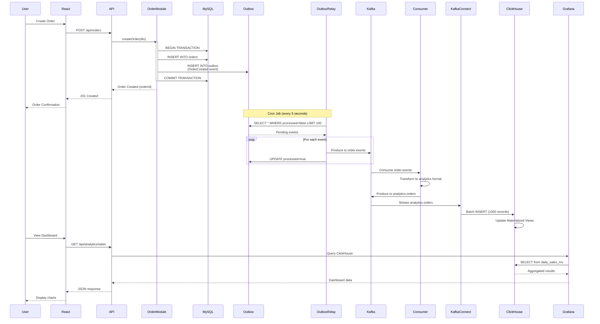
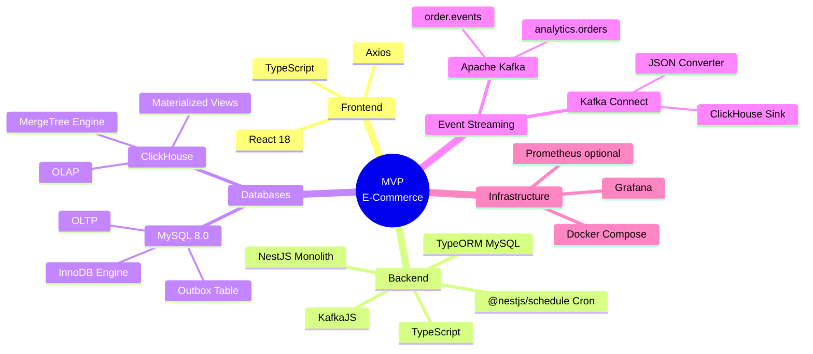
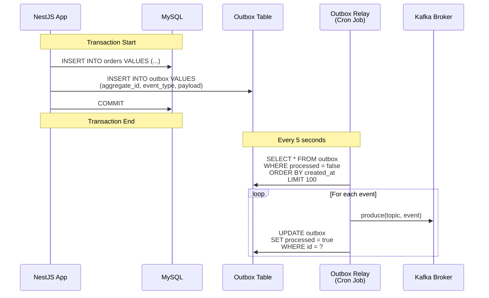
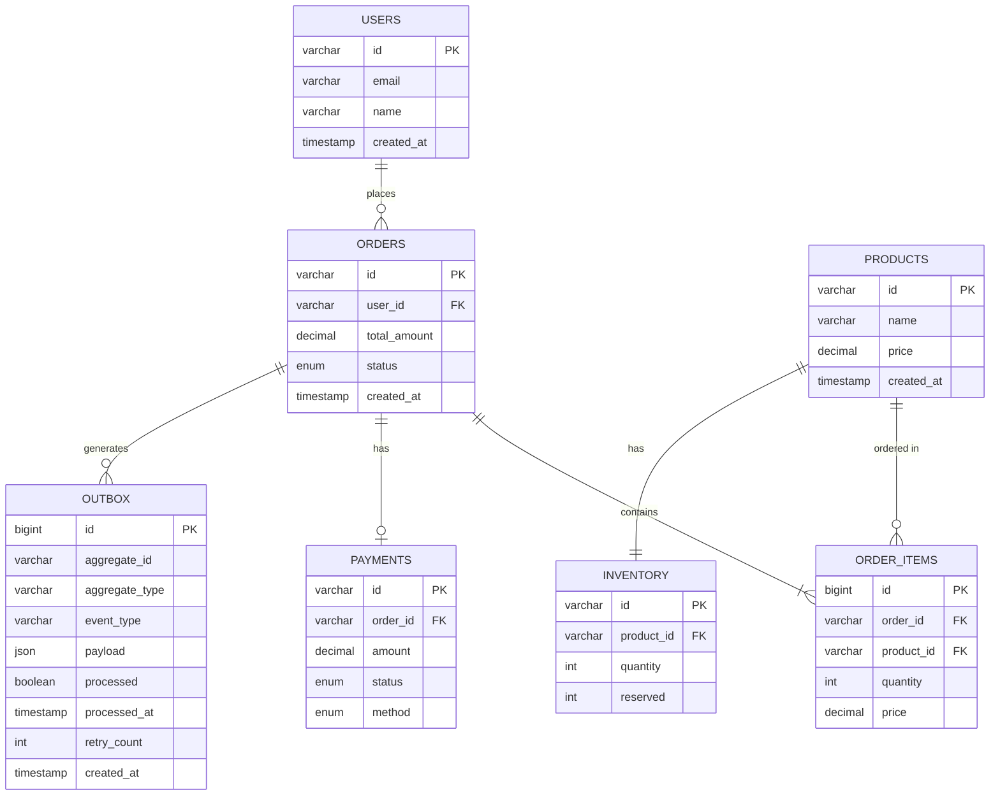
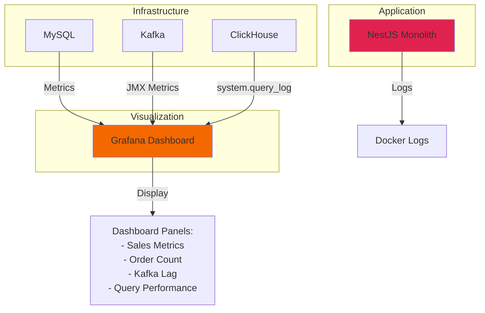

# MVP E-Commerce System Architecture

## MVP 목표에 맞는 단순화된 아키텍처

이 문서는 **로컬 Docker Compose 환경**에서 실행 가능한 MVP 아키텍처를 정의합니다.

**핵심 초점**:
- Outbox Pattern + Cron Polling
- Kafka Event Streaming
- ClickHouse 실시간 집계
- Grafana 모니터링

---

## High-Level System Architecture (MVP)

```mermaid
graph TB
    subgraph "Frontend"
        React[React App<br/>간단한 주문 폼]
    end

    subgraph "Backend - NestJS Monolith"
        API[REST API Controller]
        OrderMod[Order Module]
        PaymentMod[Payment Module]
        InventoryMod[Inventory Module]
        OutboxRelay[Outbox Relay Service<br/>Cron Polling every 5s]
        KafkaConsumer[Kafka Consumer<br/>Event Transformer]
    end

    subgraph "Data Layer"
        MySQL[(MySQL 8.0)]
        OutboxTable[(Outbox Table)]
    end

    subgraph "Event Streaming"
        Kafka[Apache Kafka]
        Topics["Topics:<br/>• order.events<br/>• payment.events<br/>• inventory.events<br/>• analytics.orders"]
        KafkaConnect[Kafka Connect<br/>ClickHouse Sink]
    end

    subgraph "Analytics Layer"
        ClickHouse[(ClickHouse)]
        MaterializedViews[Materialized Views<br/>실시간 집계]
        Grafana[Grafana Dashboard]
    end

    React -->|POST /orders| API
    API --> OrderMod
    API --> PaymentMod
    API --> InventoryMod

    OrderMod -->|Write + Outbox| MySQL
    PaymentMod -->|Write + Outbox| MySQL
    InventoryMod -->|Write + Outbox| MySQL

    MySQL --> OutboxTable

    OutboxRelay -->|Poll WHERE processed=false| OutboxTable
    OutboxRelay -->|Produce| Kafka

    Kafka --> Topics
    Topics -->|Consume & Transform| KafkaConsumer
    KafkaConsumer -->|Produce analytics| Topics

    Topics -->|Sink Connector| KafkaConnect
    KafkaConnect -->|Batch Insert| ClickHouse

    ClickHouse --> MaterializedViews
    Grafana -->|Query| MaterializedViews

    style React fill:#61dafb
    style API fill:#e0234e
    style OutboxRelay fill:#ff6b6b
    style Kafka fill:#231f20
    style ClickHouse fill:#ffcc00
    style Grafana fill:#f46800
```



---

## Detailed Event Flow (Sequence Diagram)



---

## Component Interaction - MVP Data Pipeline

```mermaid
flowchart LR
    subgraph "1. Transaction (MySQL)"
        A[User Creates Order] --> B[NestJS API]
        B --> C[MySQL: orders + outbox]
    end

    subgraph "2. Event Relay (Cron)"
        C --> D[Outbox Relay Service<br/>Poll every 5s]
        D --> E[Kafka: order.events]
    end

    subgraph "3. Event Transform"
        E --> F[Kafka Consumer<br/>Event Transformer]
        F --> G[Kafka: analytics.orders]
    end

    subgraph "4. ClickHouse Sink"
        G --> H[Kafka Connect<br/>Sink Connector]
        H --> I[ClickHouse OLAP]
    end

    subgraph "5. Real-time Aggregation"
        I --> J[Materialized Views<br/>daily_sales_mv, hourly_sales_mv]
    end

    subgraph "6. Visualization"
        K[User Views Dashboard] --> L[Grafana]
        L --> J
        J --> M[Real-time Metrics]
    end

    style A fill:#90EE90
    style C fill:#4479A1
    style E fill:#231f20
    style I fill:#ffcc00
    style L fill:#f46800
```



---

## Technology Stack (MVP)



---

## Docker Compose Architecture

```mermaid
graph TB
    subgraph "docker-compose.yml"
        subgraph "Application"
            NestJS[NestJS App<br/>Port: 3000]
            React[React App<br/>Port: 5173]
        end

        subgraph "Data Stores"
            MySQL[MySQL 8.0<br/>Port: 3306<br/>Volume: mysql-data]
            ClickHouse[ClickHouse<br/>Port: 8123, 9000<br/>Volume: clickhouse-data]
        end

        subgraph "Event Streaming"
            Zookeeper[ZooKeeper<br/>Port: 2181]
            Kafka[Kafka Broker<br/>Port: 9092]
            KafkaConnect[Kafka Connect<br/>Port: 8083]
        end

        subgraph "Monitoring"
            Grafana[Grafana<br/>Port: 3000<br/>Volume: grafana-data]
        end
    end

    React -->|HTTP| NestJS
    NestJS -->|Read/Write| MySQL
    NestJS -->|Produce| Kafka
    NestJS -->|Consume| Kafka

    Kafka --> Zookeeper
    KafkaConnect --> Kafka
    KafkaConnect --> ClickHouse

    Grafana -->|Query| ClickHouse

    style NestJS fill:#e0234e
    style MySQL fill:#4479A1
    style Kafka fill:#231f20
    style ClickHouse fill:#ffcc00
    style Grafana fill:#f46800
```



---

## Outbox Pattern Flow



---

## Data Model (MVP)



---

## ClickHouse Data Pipeline

```mermaid
flowchart TD
    A[MySQL: orders table] -->|Outbox Pattern| B[Outbox table]
    B -->|Cron Polling| C[Kafka: order.events]
    C -->|Consumer Transform| D[Kafka: analytics.orders]
    D -->|Kafka Connect Sink| E[ClickHouse: orders_analytics]

    E --> F[Materialized View:<br/>daily_sales_mv]
    E --> G[Materialized View:<br/>hourly_sales_mv]
    E --> H[Materialized View:<br/>product_ranking_mv]

    F --> I[Grafana Panel:<br/>Daily Revenue Chart]
    G --> J[Grafana Panel:<br/>Hourly Orders Chart]
    H --> K[Grafana Panel:<br/>Top 10 Products]

    style A fill:#4479A1
    style C fill:#231f20
    style E fill:#ffcc00
    style I fill:#f46800
```



---

## Monitoring Architecture (Simplified)



---

## Key Differences from Production Architecture

### ❌ Removed (MVP 범위 외)

1. **MSA 구조**: OrderService, PaymentService → 단일 NestJS Monolith
2. **Debezium CDC**: CDC → Cron Polling (5초 간격)
3. **CQRS**: 읽기/쓰기 분리 없음 (단순 구조)
4. **Kubernetes**: 클러스터 → 로컬 Docker Compose
5. **Load Balancer**: 다중 인스턴스 → 단일 인스턴스
6. **Distributed Tracing**: Jaeger → 제거
7. **Advanced Monitoring**: Prometheus + Loki → Grafana만

### ✅ Kept (MVP 핵심)

1. **Outbox Pattern**: 트랜잭션 일관성 보장
2. **Kafka Event Streaming**: 이벤트 기반 아키텍처
3. **ClickHouse Materialized Views**: 실시간 집계
4. **Kafka Connect Sink**: 자동 적재
5. **Grafana Dashboard**: 실시간 모니터링

---

## MVP Implementation Checklist

### Phase 1: Infrastructure
- [ ] `docker-compose.yml` 작성
- [ ] MySQL 컨테이너 설정
- [ ] Kafka + ZooKeeper 설정
- [ ] Kafka Connect 설정
- [ ] ClickHouse 컨테이너 설정
- [ ] Grafana 컨테이너 설정

### Phase 2: Backend
- [ ] NestJS 프로젝트 생성
- [ ] TypeORM MySQL 연동
- [ ] Order Module 구현
- [ ] Outbox Relay Service (Cron)
- [ ] Kafka Producer/Consumer

### Phase 3: Analytics
- [ ] ClickHouse 스키마 생성
- [ ] Materialized Views 구현
- [ ] Kafka Connect Sink 등록
- [ ] 데이터 적재 검증

### Phase 4: Monitoring
- [ ] Grafana 데이터 소스 설정
- [ ] Dashboard 생성 (매출, 주문)
- [ ] 실시간 데이터 검증

### Phase 5: Frontend (Optional)
- [ ] React 주문 폼
- [ ] API 연동
- [ ] 주문 내역 조회

---

## Performance Expectations (MVP)

| Metric | Target | Notes |
|--------|--------|-------|
| Outbox Polling Interval | 5초 | Cron 간격 |
| Event Delivery Latency | 5-10초 | Polling + Kafka + ClickHouse |
| ClickHouse Query | <100ms | Materialized Views 활용 |
| Order Throughput | ~100 orders/min | 단일 인스턴스 |
| Kafka Lag | <1000 messages | 정상 동작 시 |
| ClickHouse Insert Rate | ~1000 rows/sec | Batch insert |

---

## Troubleshooting Guide

### Outbox Relay 문제
```bash
# Outbox 처리 상태 확인
docker exec -it mysql mysql -u root -ptest123 -e \
  "SELECT COUNT(*) as pending FROM ecommerce.outbox WHERE processed = false;"

# Outbox Relay 로그 확인
docker logs nestjs-app | grep "Outbox Relay"
```

### Kafka 문제
```bash
# Kafka 토픽 확인
docker exec -it kafka kafka-topics.sh --list --bootstrap-server localhost:9092

# Consumer Lag 확인
docker exec -it kafka kafka-consumer-groups.sh \
  --bootstrap-server localhost:9092 \
  --group analytics-transformer --describe
```

### ClickHouse 문제
```bash
# 데이터 적재 확인
docker exec -it clickhouse clickhouse-client --query \
  "SELECT COUNT(*) FROM analytics.orders_analytics;"

# Materialized View 상태
docker exec -it clickhouse clickhouse-client --query \
  "SELECT * FROM analytics.daily_sales_mv ORDER BY order_date DESC LIMIT 5;"
```

### Grafana 문제
```bash
# Grafana 접속
open http://localhost:3001
# Default: admin/test123

# ClickHouse 데이터 소스 테스트
# Grafana UI > Configuration > Data Sources > ClickHouse > Test
```

---

## Next Steps

1. **로컬 실행**: `docker-compose up -d` 로 전체 스택 실행
2. **데이터 생성**: 주문 API 호출하여 이벤트 발생
3. **파이프라인 검증**: MySQL → Kafka → ClickHouse → Grafana 흐름 확인
4. **Dashboard 구성**: Grafana에서 실시간 매출 차트 생성
5. **성능 테스트**: 대량 주문 생성하여 처리량 측정

---

## References

### Outbox Pattern
- [Microservices.io - Transactional Outbox](https://microservices.io/patterns/data/transactional-outbox.html)
- [Polling Publisher Pattern](https://medium.com/@technologynerd/polling-publisher-pattern-c4eb41a8eb76)

### Kafka
- [Apache Kafka Documentation](https://kafka.apache.org/documentation/)
- [KafkaJS - Node.js Client](https://kafka.js.org/)

### ClickHouse
- [ClickHouse Kafka Integration](https://clickhouse.com/docs/en/engines/table-engines/integrations/kafka)
- [Materialized Views Guide](https://clickhouse.com/docs/en/guides/developer/cascading-materialized-views)

### NestJS
- [NestJS Task Scheduling](https://docs.nestjs.com/techniques/task-scheduling)
- [NestJS TypeORM](https://docs.nestjs.com/techniques/database)
